# Crowdsourcing flow review

Captured on 6 October 2026. The live screenshots below use a temporary production test event; the original review captures use isolated backend and storage fixtures. No Telegram messages were sent.

## Live release checks

The deployed guest gallery kept a portrait and a photo without faces, skipped a corrupt JPEG, and updated from empty to two photos while the page remained open. Both compact actions open their sheets, and the viewer offers original downloads.

- [Live mobile gallery and both actions](live-actions-mobile.png)
- [Live upload sheet](live-upload-sheet-mobile.png)

The screenshots use a 390 × 844 viewport. The deployed gallery also fits 320 pixels, including its long test-event title. Real browser PUTs succeeded from both the canonical site and the optional gallery subdomain.

[Live verification results](live-verification.json) cover real processing, search, downloads, access controls, credit settlement after expiry, and cleanup. The temporary gallery and its storage were removed after verification.

## Current guest controls

The guest gallery now has two compact floating pills together at the bottom: **Upload your photos** and **Find me**. Each opens its own sheet. Closing a sheet keeps uploads and search state available; only one sheet is open at a time.

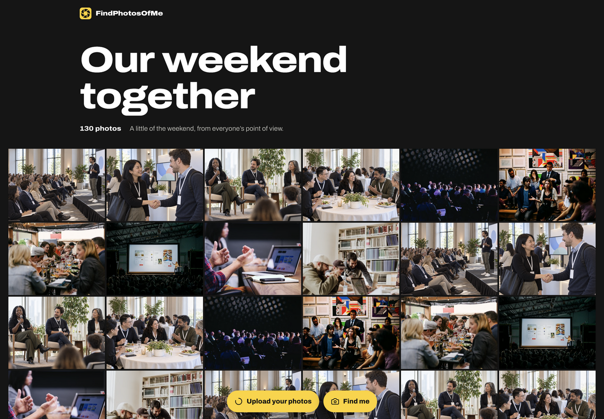

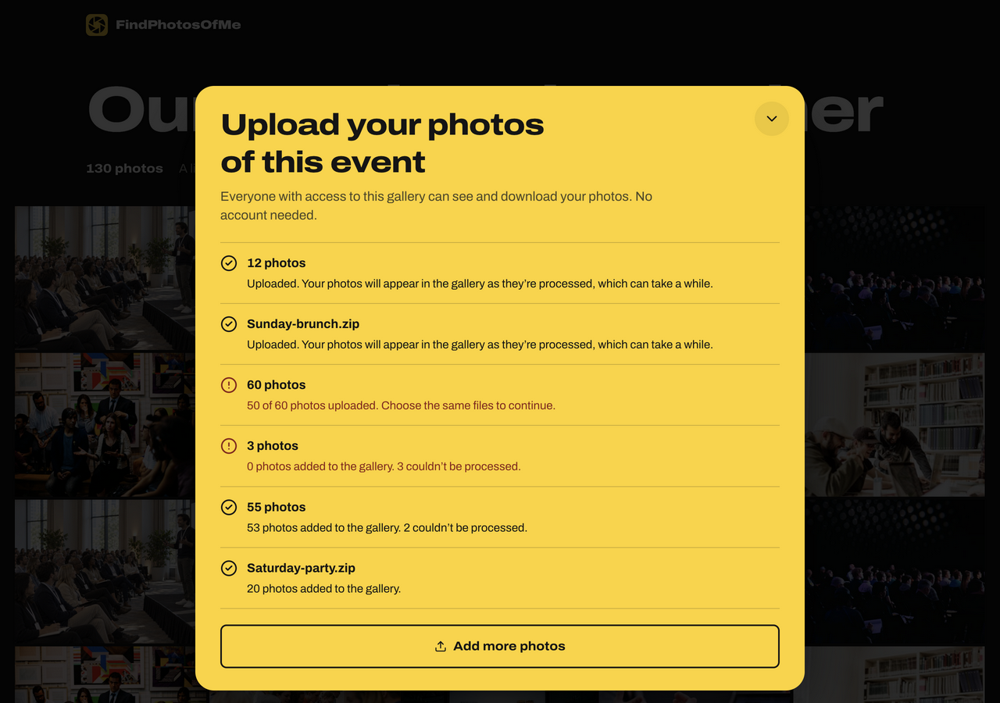

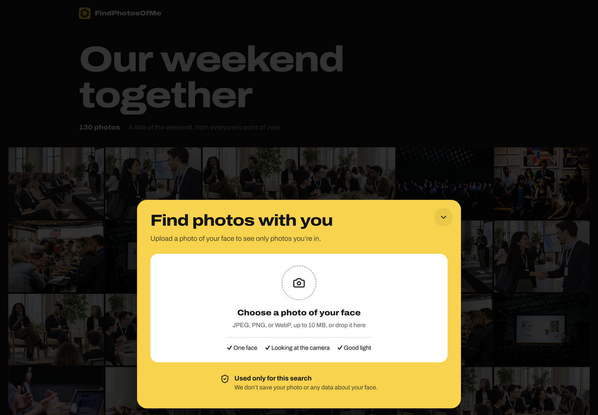

Mobile views at 390 × 844: [gallery actions](guest-actions-mobile.png), [upload sheet](guest-upload-sheet-mobile.png), [selfie sheet](guest-find-me-mobile.png). Both pills also fit a 320-pixel-wide viewport without clipping.

Verified 55 selected photos reached the fixture storage in batches of 50 and 5. Processing status survived closing, opening the search sheet, and reopening uploads. Close buttons and Escape return focus to the triggering pill; backdrop dismissal works. Disabling contributions while its sheet is open restores the remaining **Find me** action. These captures use the same pending-processing fixture described below.

The final browser pass repeated the 55-photo upload while signed out through the updated batch reservation and completion endpoints. All 55 unique objects reached storage, both batches were confirmed after the server checked stored sizes, and the page showed processing with no upload errors. [Recorded verification values](upload-verification.json). The collaborative browser disconnected after opening the search sheet during this final pass, so the existing screenshots remain the visual evidence and the earlier pass covers reopening behavior.

## Earlier recordings

The earlier guest recording and screenshots below show the previous upload panel and search banner. They remain here as the original review evidence; the screenshots above show the current interface. The admin controls are unchanged.

- [Admin setup, 8 seconds](admin-flow.mp4): choose secret-link sharing, enable guest contributions, save, and show the resulting share link.
- [Guest flow, 18 seconds](guest-flow.mp4): expand the uploader, submit 55 photos, see processing status, and browse existing photos in the viewer.

## Admin

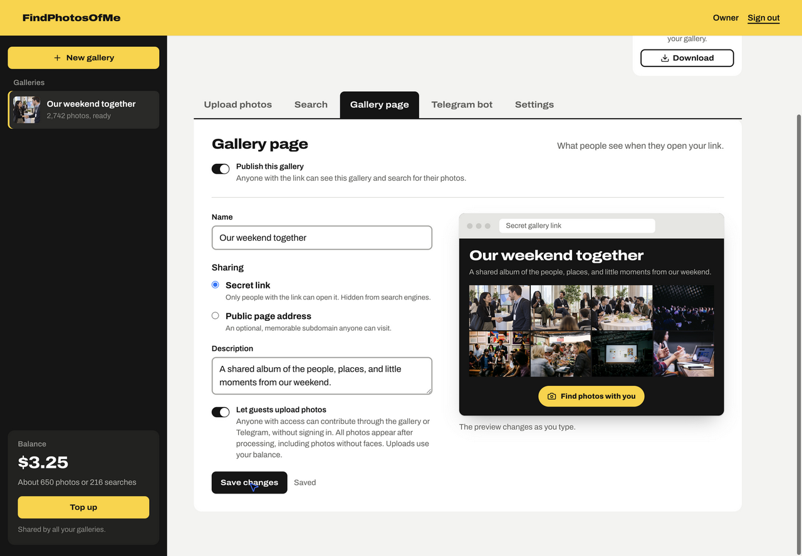

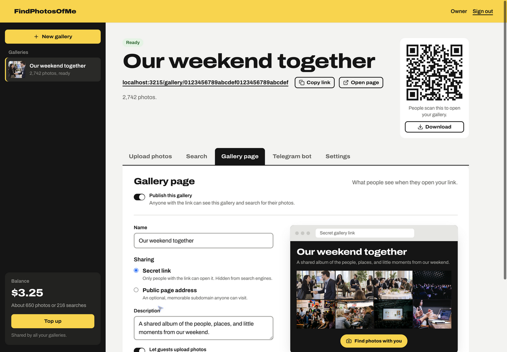

## Guest

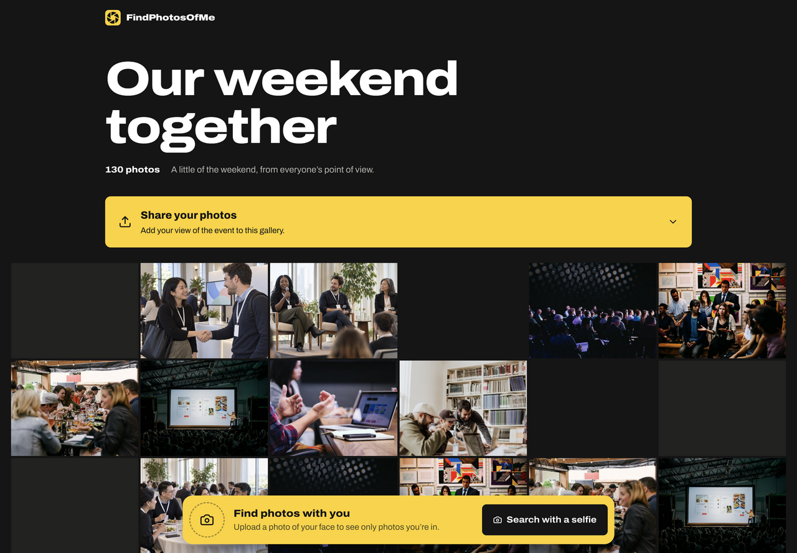

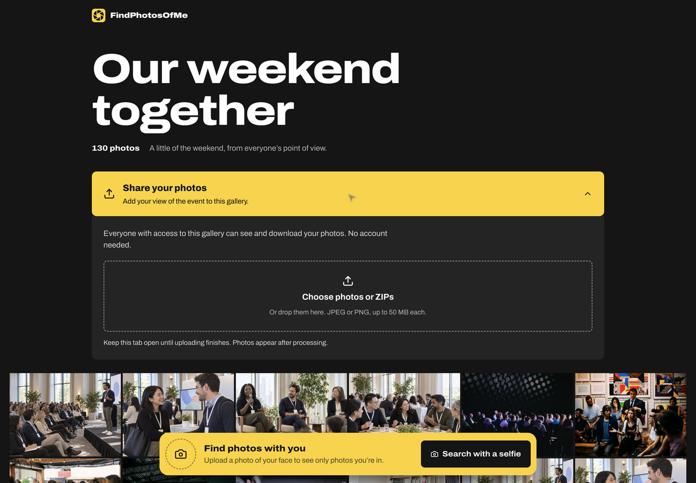

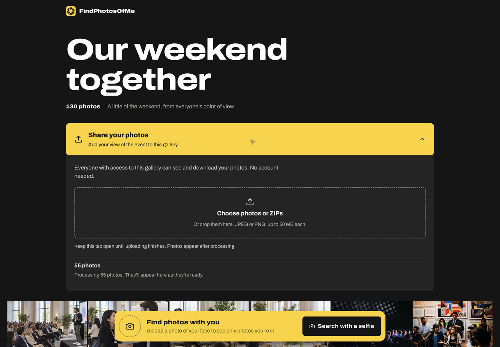

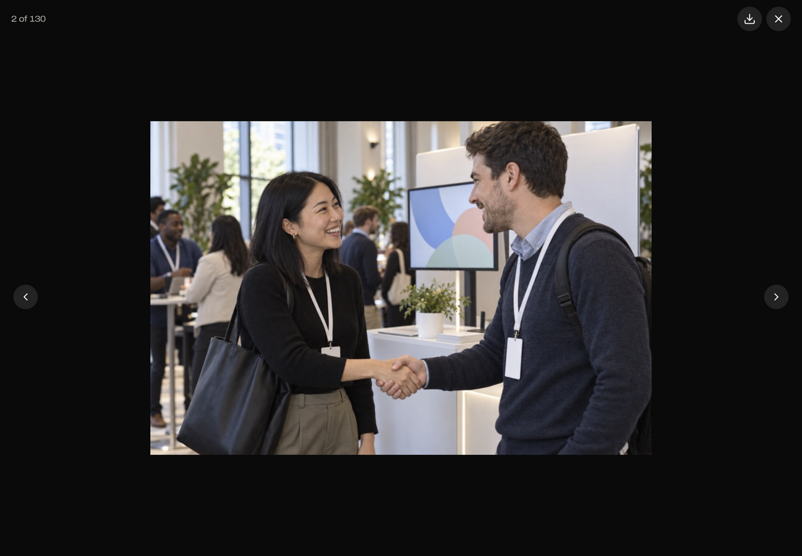

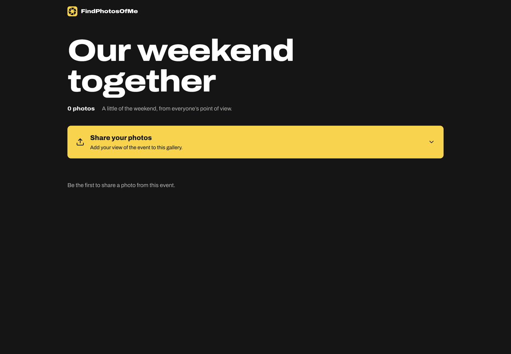

## Mobile

Captured at a 390 × 844 CSS-pixel viewport.

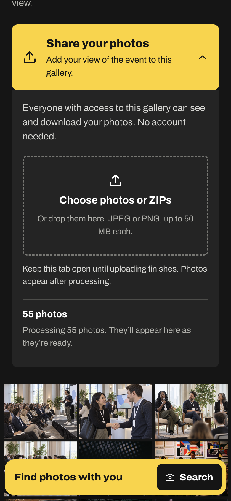

## Scope of the local preview

The admin and guest pages use independent sample galleries. The admin fixture contains 2,742 photos; the guest fixture contains 130. They are not a recording of one event moving between accounts.

The guest was signed out before recording. The 55 JPEG files were assigned to the real file input by browser automation; the native operating-system file picker is not recorded. The browser uploaded 55 distinct storage objects in two batches of 50 and 5. The fixture intentionally leaves processing pending, so the viewer shows existing sample photos rather than completed contributions. No real balance was charged.

The Telegram chat is not captured: this isolated preview has no connected test bot. Its implemented choices are **Find my photos**, **Upload photos**, and **Browse gallery → Open gallery**. A live Telegram capture remains separate from this local web review.

To reproduce the local preview, run `bunx nuxt prepare` followed by `bun tests/serve.ts` from `apps/web`. Open `http://localhost:3215/gallery/0123456789abcdef0123456789abcdef`. For admin access, the fixture accepts `owner@example.com` and code `123456` at `/sign-in`; no email is sent. Open `/admin/galleries/test-collection?tab=page`. Do not run the HTTP tests concurrently with this fixture server.
